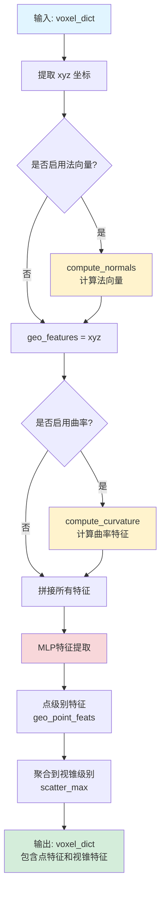
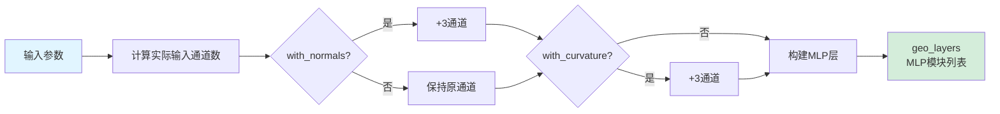
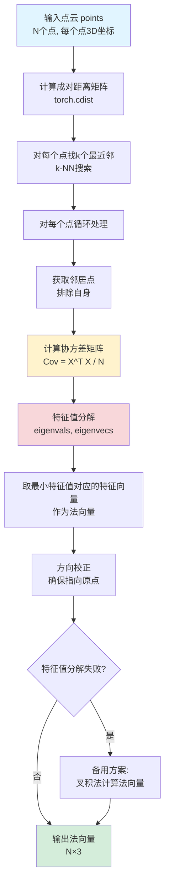
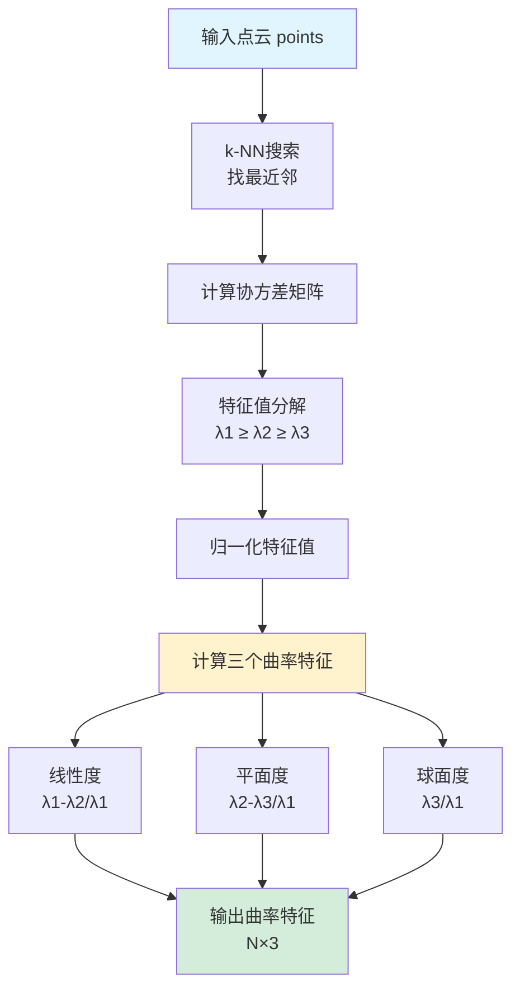
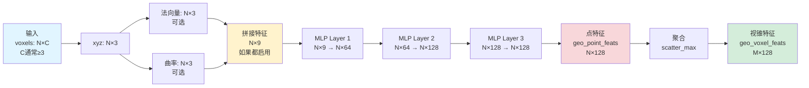
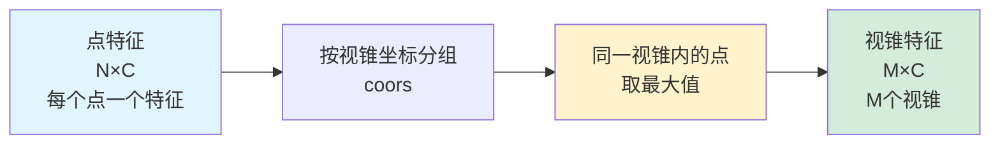

# GeometryEncoder 运行流程图解

## 整体架构图



## 详细流程说明

### 1. 初始化阶段 (__init__)



**示例**：
- 如果 `in_channels=3`, `with_normals=True`, `with_curvature=True`
- 则 `actual_in_channels = 3 + 3 + 3 = 9`
- MLP层：`[9 → 64 → 128 → 128]`

### 2. 法向量计算流程 (compute_normals)



**关键步骤**：
1. **k-NN搜索**：对每个点找最近的k个邻居（默认k=10）
2. **协方差矩阵**：计算局部邻域的协方差矩阵
3. **PCA分析**：通过特征值分解找到主方向
4. **法向量**：最小特征值对应的特征向量就是法向量

### 3. 曲率计算流程 (compute_curvature)



**曲率特征含义**：
- **线性度 (Linearity)**：接近1表示点沿一条线分布（如电线）
- **平面度 (Planarity)**：接近1表示点在一个平面上（如墙面）
- **球面度 (Sphericity)**：接近1表示点呈球形分布（如球体）

### 4. 前向传播完整流程 (forward)

```mermaid
graph TB
    A[voxel_dict输入<br/>voxels: N×C<br/>coors: N×4] --> B[提取xyz坐标<br/>features[:, :3]]
    B --> C[初始化特征列表<br/>geo_features = [xyz]]
    C --> D{with_normals?}
    D -->|是| E[compute_normals<br/>输出: N×3]
    D -->|否| F[跳过]
    E --> G[添加到特征列表]
    F --> H{with_curvature?}
    G --> H
    H -->|是| I[compute_curvature<br/>输出: N×3]
    H -->|否| J[跳过]
    I --> K[添加到特征列表]
    J --> L[拼接所有特征<br/>torch.cat]
    K --> L
    L --> M[MLP特征提取<br/>通过geo_layers]
    M --> N[点级别特征<br/>geo_point_feats: N×C_geo]
    N --> O[聚合到视锥级别<br/>scatter_max]
    O --> P[视锥级别特征<br/>geo_voxel_feats: M×C_geo]
    P --> Q[更新voxel_dict<br/>返回结果]
    
    style A fill:#e1f5ff
    style Q fill:#d4edda
    style M fill:#f8d7da
    style O fill:#fff3cd
```

### 5. 数据维度变化



## 关键算法详解

### k-NN搜索和协方差计算

```python
# 伪代码示例
for each point p_i:
    # 1. 找k个最近邻
    neighbors = k_nearest_neighbors(p_i, k=10)
    
    # 2. 计算局部坐标系
    centered = neighbors - p_i  # [k, 3]
    
    # 3. 协方差矩阵
    cov = (centered.T @ centered) / k  # [3, 3]
    
    # 4. 特征值分解
    eigenvals, eigenvecs = eigendecomposition(cov)
    
    # 5. 法向量 = 最小特征值对应的特征向量
    normal = eigenvecs[:, min_eigenval_index]
    
    # 6. 曲率特征 = 基于特征值的几何描述
    curvature = compute_curvature_features(eigenvals)
```

### 特征聚合 (scatter_max)



**为什么用max pooling？**
- 保持几何结构的显著性
- 避免平均化导致的细节丢失
- 适合几何特征（如法向量、曲率）

## 运行示例

假设输入：
- `N = 1000` 个点
- `C = 4` (xyz + intensity)
- `with_normals = True`
- `with_curvature = True`
- `k_neighbors = 10`

**处理流程**：

1. **输入**：`voxels: [1000, 4]`, `coors: [1000, 4]`

2. **提取xyz**：`xyz: [1000, 3]`

3. **计算法向量**：
   - 对每个点找10个最近邻
   - 计算1000个协方差矩阵 [3×3]
   - 特征值分解得到法向量
   - 输出：`normals: [1000, 3]`

4. **计算曲率**：
   - 同样使用k-NN
   - 基于特征值计算线性度、平面度、球面度
   - 输出：`curvature: [1000, 3]`

5. **特征拼接**：
   - `geo_input = concat([xyz, normals, curvature])`
   - 输出：`[1000, 9]`

6. **MLP处理**：
   - Layer 1: `[1000, 9] → [1000, 64]`
   - Layer 2: `[1000, 64] → [1000, 128]`
   - Layer 3: `[1000, 128] → [1000, 128]`

7. **点级别输出**：`geo_point_feats: [1000, 128]`

8. **视锥级别聚合**：
   - 假设有 `M = 500` 个视锥
   - 每个视锥内的点特征取最大值
   - 输出：`geo_voxel_feats: [500, 128]`

## 设计特点

1. **小感受野**：k=10，只关注局部几何结构
2. **结构保持**：使用max pooling而非mean pooling
3. **几何专注**：只处理几何信息，不涉及语义
4. **可配置**：可以选择性启用法向量和曲率

## 输出说明

返回的 `voxel_dict` 包含：
- `geo_point_feats`: 点级别的几何特征 [N, C_geo]
- `geo_voxel_feats`: 视锥级别的几何特征 [M, C_geo]
- `geo_voxel_coors`: 视锥坐标 [M, 4]

这些特征将用于后续的交叉门控融合模块。

